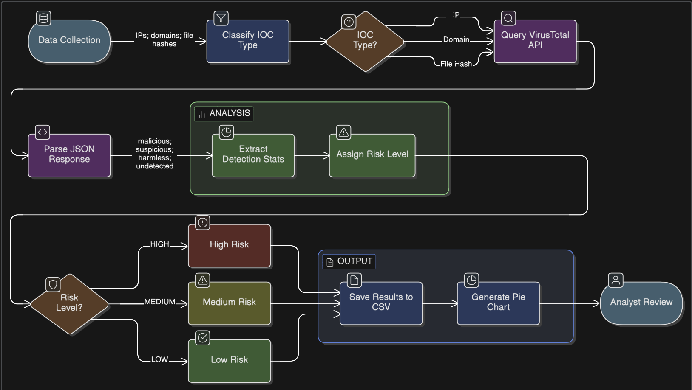

# VirusTotal Incident Response Analysis: IOC Investigation Using API Automation
Final Project | BFOR 643 - Incident Handling

Team Members: Nicholas Suchy, Jack Carroll, Humaira Rezaie, Dylan Langdon

## 🔷 Project Overview

This project demonstrates how VirusTotal can be used in a real-world Incident Response (IR) scenario to analyze Indicators of Compromise (IOCs) associated with malware activity.

We developed a Python-based script that leverages the VirusTotal API to automatically query and analyze IOCs, including file hashes, IP addresses, and domains. The script retrieves detection statistics such as malicious, suspicious, harmless, and undetected counts and exports the results into a structured CSV file.

These results are then visualized to support analysis and demonstrate how a security analyst would triage potential threats in a real-world environment.

This project emphasizes both technical implementation and practical application within the incident response lifecycle.

**Objective:**  
To simulate a practical incident response workflow by automating IOC analysis, validating potential threats, and supporting analyst decision-making.
***
## 🔷 Project Relevance (Incident Response Context)

VirusTotal is a widely used tool in cybersecurity and Incident Response (IR) for analyzing suspicious files, URLs, IP addresses, and domains. It aggregates detection results from dozens of antivirus engines and threat intelligence sources, allowing analysts to quickly determine whether an indicator is malicious.

### 🔹 Role in the Incident Response Lifecycle

VirusTotal plays a critical role across multiple phases of the Incident Response lifecycle:

| IR Phase      | Role of VirusTotal |
|--------------|------------------|
| Detection     | Identifies suspicious or known malicious indicators from alerts or logs |
| Analysis      | Investigates IOCs such as file hashes, domains, and IP addresses |
| Containment   | Provides intelligence that can be used to block malicious infrastructure (IPs/domains) |
| Eradication   | Validates removal of known threats by re-checking associated IOCs |
| Recovery      | Helps verify that systems are no longer communicating with known malicious entities |

### 🔹 Practical Use in Real-World Scenarios

In real-world environments, security analysts use VirusTotal to:

- Validate alerts generated by security tools (SIEM, IDS/IPS, EDR)  
- Enrich Indicators of Compromise (IOCs) with threat intelligence  
- Identify relationships between malware samples, domains, and IP addresses  
- Prioritize threats based on detection confidence across multiple engines  

For example, when an alert is triggered for suspicious network traffic, an analyst can extract the associated IP address or domain and query VirusTotal to quickly determine whether it is linked to known malicious activity.

### 🔹 Why VirusTotal is Important

VirusTotal significantly improves the speed and efficiency of threat triage by providing:

- Rapid reputation checks across multiple security vendors  
- Centralized access to threat intelligence data  
- A scalable way to analyze large sets of IOCs  

However, it is important to note that VirusTotal is a **supporting tool**, not a definitive source of truth. Analysts must combine its results with additional context and investigation to make accurate decisions.

This makes VirusTotal a critical component in modern incident response workflows, particularly for initial threat validation and investigation.
***

### 🔹 Phantom Stealer: Why This Threat Was Chosen 
Phantom Stealer is an infostealer malware that targets browser credentials, saved passwords, cookies, cryptocurrency wallets, and Discord session tokens. Because it is able to exfiltrate sensitive data quickly after an infection, analysts have a very narrow window to detect and contain it. 

The January 2026 sample obtained from malware-traffic-analysis.net was chosen because it represents a current, real world threat with clearly documented IOCs across multiple types of file hashes, IP addresses, and domains. This made it an ideal demonstration for how a python automated VirusTotal workflow can be applied to a realistic incident response scenario. Rather than using generic IOCs, working from an actual malware sample grounds the project in similar conditions to what a SOC analyst would have to deal with. 

Phantom Stealer is usually delivered using phishing emails containing malicious ISO files that are designed to bypass email based antivirus scanning. Once executed it then exfiltrates stolen data through telegram bot APIs, Discord webhooks, and FTP servers. The reliance on external infrastructure means that domains and IP addresses associated with the sample are highly actionable IOCs. That is why blocking them at the network level is one of the most effective ways for containment that an analyst can take during an active incident. 
***

## 🔷 Methodology

### 🔹 Tools & Technologies

- Python (for scripting and automation)
- VirusTotal API (for IOC analysis)
- CSV (for structured data storage)
- Visualization tools (e.g., matplotlib or similar) *(if used)*

### 🔹 Data Source

The Indicators of Compromise (IOCs) used in this project were derived from a Phantom Stealer malware sample (2026-01-30), obtained from:

- https://www.malware-traffic-analysis.net/

Types of IOCs analyzed:
- File hashes (MD5/SHA256)
- IP addresses
- Domain names

These IOCs were extracted and manually selected for automated analysis.  
*(Teammate: briefly describe how the IOCs were collected or chosen)*

### 🔹 Script Functionality

A Python-based script was developed to automate the process of querying VirusTotal for IOC analysis.

#### Core Features:

- Accepts input IOCs (file hashes, IPs, domains)
- Sends API requests to VirusTotal
- Extracts detection statistics:
  - Malicious
  - Suspicious
  - Harmless
  - Undetected
- Outputs results to a CSV file

*(Teammate: describe any additional functionality such as loops, filtering, or error handling)*

### 🔹 API Interaction

The script interacts with the VirusTotal API by:

1. Authenticating using an API key  
2. Sending requests for each IOC  
3. Receiving and parsing JSON responses  
4. Extracting relevant detection statistics  

*(Teammate: specify how requests are made — e.g., Python libraries used, API endpoints, request format)*

### 🔹 Data Processing & Output

- Each IOC is processed individually  
- Results are formatted into rows containing:
  - IOC value  
  - IOC type  
  - Detection counts  
- Output is saved as a `.csv` file in the `results/` folder  

*(Teammate: explain how data is structured or formatted in the CSV file)*

### 🔹 Visualization

Detection results are visualized to support analysis.

Possible visualizations include:
- Pie charts showing counts for Malicious, Suspicious, Harmless, Undetected  
- Distribution of detection counts across IOC types  

*(Teammate: describe what visualizations were created and what tools/libraries were used)*

### 🔹 Workflow

The overall workflow of the project is as follows:

1. Collect IOCs from malware sample  
2. Input IOCs into the Python script  
3. Query VirusTotal API for each IOC  
4. Extract detection results  
5. Save results to CSV  
6. Generate visualizations  
7. Analyze results in an incident response context  

### 🔹 Workflow Diagram

***

## 🔷 Results Summary
